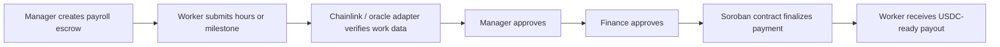
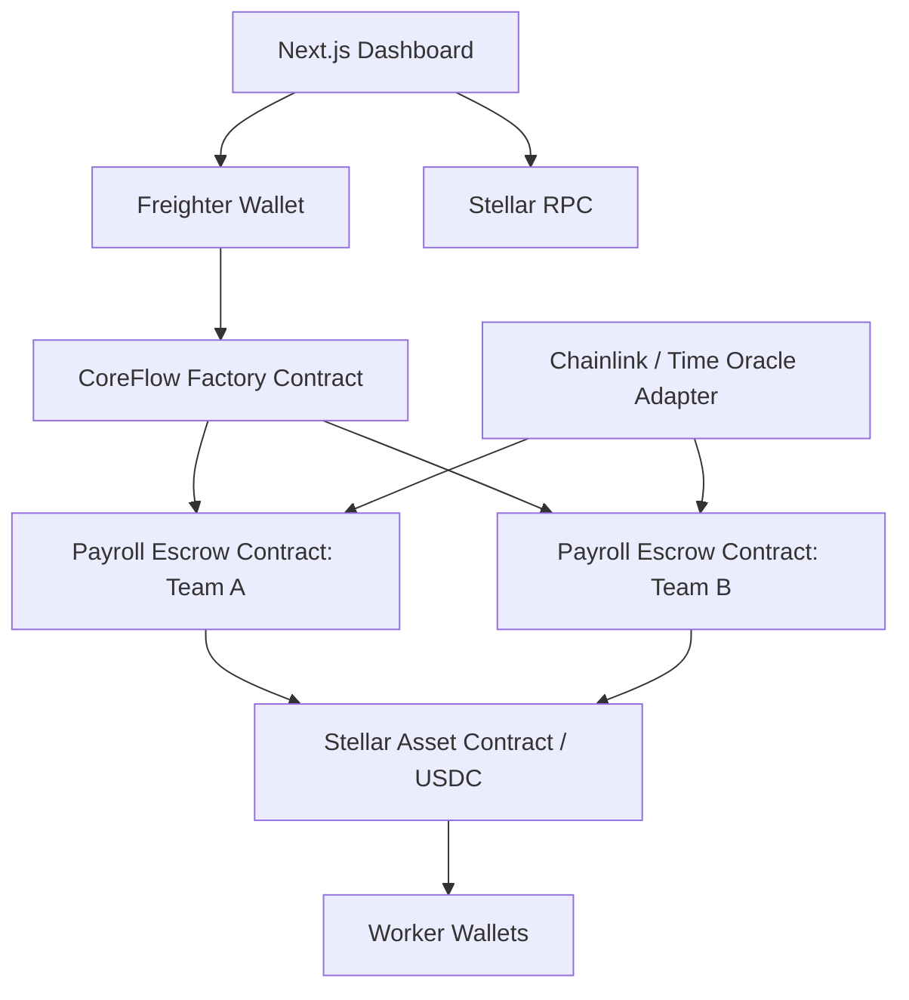

<div align="center">

# CoreFlow

### Trustless Payroll and B2B Escrow on Stellar Soroban

[](https://stellar.org)
[](https://developers.stellar.org/docs)
[](https://www.rust-lang.org/)
[](https://nextjs.org)
[](LICENSE)

**CoreFlow** is an on-chain accounts payable and payroll escrow system for remote teams. It combines **Soroban smart contracts**, **multi-signature payment approvals**, **oracle-verified work records**, and **USDC-ready settlement** to help companies pay distributed workers with stronger transparency, auditability, and cost predictability.

[Problem](#-the-problem) · [Solution](#-the-solution) · [Architecture](#-architecture-deep-dive) · [Gas Optimization](#-gas-optimization-case-study) · [Why Stellar](#-why-stellar) · [Market](#-market-opportunity) · [Getting Started](#-getting-started)

</div>

---

> [!IMPORTANT]
> **Stellar Mainnet MVP Contract**
>
> - **Contract ID:** `CCTF5WBOQR7JP2KPLQT372X7JCGCINHDFRSAPF4YTYRKZXZ3J2XPRFFW`
> - **Deployer / Manager Address:** `GBPLBGLHRDLWGA4XXIQOHCQXP23EN4IPJBCOTZ7KRDJXM5Y7YKPIL3SG`
> - **WASM Hash:** `1ed0b9d99371d970b08cf74f3ff7c447721d6f01c1a3ba78d29645ab29999cee`
> - **Network:** Stellar Public Network
>
> The current MVP demonstrates the on-chain payroll approval state machine. Production deployment should connect the finalized payment path to Stellar Asset Contract / USDC token transfer and use a production-grade oracle verification scheme.

---

## Table of Contents

- [The Problem](#-the-problem)
- [The Solution](#-the-solution)
- [CoreFlow in One Flow](#-coreflow-in-one-flow)
- [Architecture Deep Dive](#-architecture-deep-dive)
- [Gas Optimization Case Study](#-gas-optimization-case-study)
- [Why Stellar?](#-why-stellar)
- [Market Opportunity](#-market-opportunity)
- [Go-to-Market Strategy](#-go-to-market-strategy)
- [Stellar Ecosystem Growth](#-stellar-ecosystem-growth)
- [Tech Stack](#-tech-stack)
- [Project Structure](#-project-structure)
- [Getting Started](#-getting-started)
- [Smart Contract API](#-smart-contract-api)
- [Development](#-development)
- [Security and Production Checklist](#-security-and-production-checklist)
- [References](#-references)

---

## The Problem

Remote work has made talent global, but payroll and accounts payable infrastructure has not kept pace. Philippine freelancers, agencies, DAOs, and distributed startups often still depend on manual invoices, email approvals, screenshots from time trackers, bank wires, and payment processors that create delays, hidden fees, reconciliation work, and weak payment visibility.

For teams paying international contractors, the pain is concentrated in three areas:

| Pain Point | What Happens Today | Why It Matters |
|---|---|---|
| **Slow settlement** | Payments may pass through several intermediaries before reaching the worker. | Contractors have limited visibility and finance teams cannot guarantee predictable payout timing. |
| **Manual verification** | Hours, milestones, approvals, and invoices are checked through spreadsheets, emails, or screenshots. | Manual AP workflows are difficult to audit and prone to disputes or duplicate work. |
| **Weak trust layer** | Workers must trust the client to pay, while clients must trust submitted work records. | Neither side has a neutral escrow and verification layer that enforces the payout rules. |

CoreFlow focuses on this gap: **verified work should trigger transparent, programmable, and low-cost payment release without requiring either side to blindly trust the other.**

---

## The Solution

CoreFlow replaces the traditional remote payroll workflow with a **trustless multi-signature escrow system** on Stellar Soroban.

| Legacy Workflow | CoreFlow Workflow |
|---|---|
| Email-based approvals | On-chain manager and finance approvals |
| Manual time-tracking evidence | Oracle-verified hours proof |
| Spreadsheet status tracking | Immutable contract state and event logs |
| Bank-wire settlement delays | USDC-ready settlement through Stellar assets |
| One-off payment processes per client | Factory-deployed payroll contracts per team, project, or agency |

In CoreFlow, a team creates an escrow, assigns workers and payment schedules, verifies work through an oracle proof, requires both manager and finance approval, then finalizes payment once all conditions are satisfied.

---

## CoreFlow in One Flow



The current MVP implements the core approval state machine: escrow creation, payment schedules, oracle-proof submission, manager approval, finance approval, finalization status, cancellation, and event emission. The production version should connect the finalization step to Stellar Asset Contract token transfer for actual USDC movement.

---

## Architecture Deep Dive

### 1. Smart Contract System

CoreFlow is designed as a modular Soroban contract system.



### 2. Trustless Multi-Signature Escrow

The escrow contract acts as a neutral payment coordinator. The manager cannot unilaterally release funds after escrow creation. The finance approver cannot bypass work verification. The worker cannot mark payment as ready without a valid work proof. This creates a practical separation of duties for payroll and B2B contractor payments.

The MVP contract stores each escrow with a manager address, finance approver address, payment schedule vector, approval flags, and cancellation flag. The manager and finance roles must authorize their own approval calls with Soroban `Address::require_auth()`. Finalization checks that both approvals are present before marking payments as finalized.

The production escrow should enforce four conditions before token transfer:

1. The escrow exists and is not cancelled.
2. The payment schedule exists and has not been finalized.
3. Work data has been verified by the oracle adapter.
4. Manager and finance approvals are both present.

Only after those checks should the contract call the Stellar Asset Contract token interface to transfer USDC from escrow-controlled funds to the worker.

### 3. Factory Pattern for Scalability

CoreFlow uses a factory pattern to avoid forcing every client, agency, or project into one large shared contract state. A factory contract can deploy or initialize separate payroll escrow contracts from the same audited WASM hash.

The factory pattern improves scalability in five ways:

| Benefit | Why It Matters |
|---|---|
| **Isolated contract state** | Each organization or project can have its own escrow contract instead of sharing a global storage map. |
| **Lower blast radius** | A disputed or paused payroll instance does not block other client payroll contracts. |
| **Deterministic deployment** | Soroban supports contract deployment through the SDK deployer API with deterministic addresses derived from deployer and salt. |
| **Reusable audited template** | The factory deploys new instances from the same uploaded WASM hash, reducing repeated engineering effort. |
| **Indexable registry** | The factory can emit `payroll_created` events and maintain a registry of organization-to-contract mappings for dashboards and analytics. |

Recommended factory responsibilities:

```rust
pub fn deploy_payroll_contract(
    env: Env,
    admin: Address,
    wasm_hash: BytesN<32>,
    salt: BytesN<32>,
    constructor_args: Vec<Val>,
) -> Address
```

The factory should not process payroll itself. It should deploy escrow instances, store a lightweight registry, and emit events. Payroll execution should stay inside the dedicated escrow contracts.

### 4. Oracle-Verified Time Tracking

Blockchains cannot directly read private time-tracking tools such as Clockify, Harvest, Jira, GitHub, or internal HR systems. CoreFlow therefore uses an oracle adapter pattern.

The oracle layer performs off-chain verification and sends a signed proof to Soroban:

```text
worker_address
escrow_id
payment_id
hours_logged
period_start
period_end
time_source_hash
nonce
oracle_signature
```

A Chainlink-powered adapter can fetch or compute work data off-chain, normalize the result, and sign the proof. The Soroban contract then verifies the signature or authorized oracle address before updating the payment schedule. For the MVP, the current contract validates signature length as a placeholder; production should replace this with full Ed25519 verification, replay protection, nonce tracking, and oracle public-key rotation.

---

## Gas Optimization Case Study

### Goal

`pay_batch` is a production-oriented function that pays multiple workers or payment schedules in one transaction. Instead of requiring one transaction per worker, the function amortizes authorization, storage reads, storage writes, event emission, and network overhead across a batch.

### Simplified `pay_batch` Sketch

```rust
pub fn pay_batch(
    env: Env,
    escrow_id: u32,
    payment_ids: Vec<u32>,
    token: Address,
) -> Result<u32, ContractError> {
    let mut escrow: CoreFlowEscrow = env
        .storage()
        .instance()
        .get(&DataKey::Escrow(escrow_id))
        .ok_or(ContractError::InvalidPaymentId)?;

    if escrow.cancelled {
        return Err(ContractError::EscrowCancelled);
    }

    escrow.manager.require_auth();

    if !escrow.manager_approved || !escrow.finance_approved {
        return Err(ContractError::InsufficientApprovals);
    }

    let token_client = soroban_sdk::token::Client::new(&env, &token);
    let escrow_address = env.current_contract_address();

    let mut paid_count: u32 = 0;
    let mut total_paid: i128 = 0;

    for payment_id in payment_ids.iter() {
        if payment_id >= escrow.payments.len() {
            return Err(ContractError::InvalidPaymentId);
        }

        let mut payment = escrow.payments.get(payment_id).unwrap();

        if payment.status == PaymentStatus::Finalized {
            return Err(ContractError::PaymentAlreadyFinalized);
        }

        // Production condition: require verified hours or milestone proof.
        if payment.hours_logged <= 0 || payment.amount <= 0 {
            return Err(ContractError::InvalidAmount);
        }

        token_client.transfer(&escrow_address, &payment.worker, &payment.amount);

        payment.status = PaymentStatus::Finalized;
        escrow.payments.set(payment_id, payment);

        paid_count += 1;
        total_paid += payment.amount;
    }

    env.storage().instance().set(&DataKey::Escrow(escrow_id), &escrow);
    env.storage().instance().extend_ttl(INSTANCE_TTL_THRESHOLD, INSTANCE_TTL_EXTEND);

    env.events().publish(
        (symbol_short!("pay"), symbol_short!("batch")),
        (escrow_id, paid_count, total_paid),
    );

    Ok(paid_count)
}
```

### Optimization Strategies

| Strategy | Implementation Detail | Gas / Cost Benefit |
|---|---|---|
| **Batch operations** | Pay many schedules in one invocation instead of one transaction per worker. | Reduces repeated transaction overhead and repeated authorization calls. |
| **Single escrow read** | Load the escrow once before the loop. | Avoids repeated storage reads per payment. |
| **Single escrow write** | Update all selected schedules in memory, then write escrow state once after the loop. | Reduces storage write frequency, which is usually more expensive than memory operations. |
| **Compact identifiers** | Use `u32` payment IDs and escrow IDs instead of large strings. | Reduces serialized data size. |
| **Short event topics** | Use `symbol_short!` event labels such as `pay` and `batch`. | Keeps emitted event payload compact. |
| **Minimal return data** | Return only `paid_count`, not the full payment vector. | Avoids returning large serialized objects to the caller. |
| **Factory-isolated state** | Store only one client or project payroll per child contract. | Keeps state lookup smaller and improves operational separation. |
| **TTL-aware storage** | Extend TTL only when necessary and use the right storage class for the data lifecycle. | Controls long-term storage rent and archival risk. |

### MVP vs. Production Note

The current MVP `finalize_payment` function finalizes payment schedules and emits a total amount event. For production, `pay_batch` should call the Stellar Asset Contract token interface so finalization also moves USDC or another supported Stellar asset.

---

## Why Stellar?

CoreFlow is built on Stellar because the project is a B2B payments and payroll product first, not a generic DeFi application.

| Requirement | Why Stellar Fits |
|---|---|
| **Low-cost payroll transactions** | Stellar is designed for rapid payments and low-cost transactions, making small contractor payouts and batch payroll economically practical. |
| **Stablecoin and fiat-asset workflows** | Stellar assets can be represented through trustlines and used by smart contracts through the Stellar Asset Contract, allowing CoreFlow to support USDC-style settlement without deploying a custom token. |
| **Compliance-aware rails** | Stellar’s anchor standards support KYC, deposit/withdrawal, quotes, and cross-border payment workflows, which are important for real B2B payroll and off-ramp use cases. |
| **Smart contracts with strong auth** | Soroban’s authorization model allows contracts to enforce role-based approvals using account-level authorization instead of relying on ad hoc signature parsing for every role. |
| **Predictable user experience** | Payroll users need predictable fees, wallet signing, auditable status, and reliable settlement more than speculative throughput. Stellar’s payments-first design matches this requirement. |

Compared with many EVM chains, Stellar gives CoreFlow a more payment-native asset model and a lower-cost UX target. Compared with high-throughput chains such as Solana, Stellar is better aligned with regulated assets, on/off-ramp standards, and enterprise payment interoperability for this specific payroll use case.

---

## Market Opportunity

CoreFlow begins with the Philippines because it has a dense market of remote workers, online freelancers, agencies, and outsourcing businesses that already serve international clients.

| Market Signal | Why It Matters for CoreFlow |
|---|---|
| **~1.5M estimated Filipino online freelancers** | A large freelancer base creates demand for transparent, low-cost international payment workflows. |
| **Philippine IT-BPM employment projected at 1.82M jobs and $38B revenue in 2024** | The country already exports remote and back-office services at scale. |
| **Philippines B2B payments market: $5.8B in 2025, projected $12.9B by 2034** | The local B2B payment opportunity is large enough for a focused Philippine wedge. |
| **SEA B2B payments market: $49.0B in 2025, projected $112.5B by 2034** | Regional expansion can move CoreFlow from freelancer payroll into broader supplier and contractor payments. |
| **SEA digital economy GMV: $263B in 2024** | Digital-first commerce and services create more demand for programmable payment infrastructure. |
| **Global B2B payments market: $11.69T in 2024, projected $15.88T by 2030** | The long-term opportunity extends beyond freelancers into global AP automation. |

CoreFlow’s wedge is narrow but expandable: start with verified freelancer and agency payouts, then expand into recurring contractor payroll, supplier payments, DAO treasury operations, and full-stack B2B payment orchestration.

---

## Go-to-Market Strategy

### Phase 1 — Philippine Freelancer and Agency Pilot

Target users:

- Filipino freelancers paid by overseas clients
- Small VA, design, development, and marketing agencies
- Remote-first Philippine teams managing contractor payouts

Execution:

- Run pilots with 3–5 freelancer agencies.
- Support USDC test payments and mainnet micro-payment demos.
- Integrate one time-tracking source through an oracle adapter.
- Offer downloadable on-chain receipts for each payout.
- Measure settlement time, approval time, failed payment rate, and estimated fee savings.

Success metric:

- At least one agency processes recurring payroll through CoreFlow’s escrow workflow.

### Phase 2 — Southeast Asia Expansion

Target markets:

- Philippines, Indonesia, Vietnam, Thailand, Malaysia, and Singapore
- Agencies and SMBs that hire remote contractors across borders
- Web3 teams and DAOs already comfortable with wallet-based finance

Execution:

- Add multi-currency display and local off-ramp partner discovery.
- Add payroll templates for weekly, biweekly, monthly, and milestone-based schedules.
- Launch factory-created payroll contracts for agencies and remote teams.
- Add dashboard analytics for finance teams: pending approvals, cash-flow forecast, and payout history.

Success metric:

- Multi-country contractor payout workflows with repeat monthly usage.

### Phase 3 — Global B2B Payment Platform

Target users:

- Global SMBs
- Outsourcing firms
- Treasury teams
- B2B marketplaces
- Contractor management platforms

Execution:

- Build API access for payroll platforms, accounting tools, and ERP systems.
- Add programmable supplier escrow and invoice settlement.
- Support stablecoin settlement, compliance-aware on/off-ramp flows, and enterprise audit exports.
- Position CoreFlow as the programmable accounts payable layer for international service work.

Success metric:

- CoreFlow moves from dashboard-only usage into embedded payment infrastructure.

---

## Stellar Ecosystem Growth

CoreFlow can grow the Stellar ecosystem in ways that go beyond transaction volume.

| Growth Area | Ecosystem Impact |
|---|---|
| **More real payment volume** | Recurring payroll and contractor payouts create practical, non-speculative Stellar usage. |
| **More stablecoin utility** | USDC-ready payroll gives workers and agencies a reason to hold, receive, and off-ramp Stellar assets. |
| **More Soroban developers** | The project demonstrates factory deployment, auth-based approvals, oracle verification, and token payment patterns in Rust. |
| **More anchor demand** | Freelancer and agency users need fiat on/off-ramps, creating demand for local anchor integrations. |
| **More enterprise use cases** | CoreFlow frames Stellar as infrastructure for AP automation, not only remittances or consumer transfers. |
| **More wallet adoption** | Workers, managers, and finance approvers interact with Stellar wallets through a real payroll workflow. |

If CoreFlow succeeds, Stellar gains a repeatable pattern for verified work-to-payment automation: escrow, proof, approval, settlement, and receipt.

---

## Tech Stack

| Layer | Technology | Purpose |
|---|---|---|
| Smart Contracts | Rust + Soroban SDK | Escrow logic, role authorization, oracle proof handling, payment finalization |
| Contract Architecture | Factory pattern | Deploy isolated payroll contracts per team, agency, or project |
| Token Settlement | Stellar Asset Contract / USDC-ready | Production path for asset transfer from escrow to workers |
| Oracle Layer | Chainlink / external oracle adapter | Verify time-tracking or milestone evidence before payment approval |
| Frontend | Next.js 14 + TypeScript | Payroll dashboard, escrow cards, approval flow, transaction UX |
| Wallet | Freighter | Stellar wallet connection and transaction signing |
| Styling | Tailwind CSS + shadcn/ui | Responsive dashboard interface |
| Network | Stellar Testnet / Public Network | Testing and mainnet deployment |

---

## Project Structure

```text
coreflow/
├── contracts/
│   └── core-flow/
│       ├── src/
│       │   ├── lib.rs              # Core escrow contract
│       │   └── test.rs             # Unit tests
│       ├── Cargo.toml
│       └── Cargo.lock
├── public/
│   └── logo-readme.png             # README logo
├── src/
│   ├── app/
│   │   ├── layout.tsx
│   │   ├── globals.css
│   │   └── dashboard/
│   │       └── page.tsx
│   ├── components/
│   │   ├── WalletButton.tsx
│   │   ├── EscrowCard.tsx
│   │   ├── TransactionFeed.tsx
│   │   ├── Button.tsx
│   │   ├── Card.tsx
│   │   └── Alert.tsx
│   └── lib/
│       ├── config.ts               # Stellar network and wallet config
│       └── contracts.ts            # CoreFlow client and transaction helpers
├── .env.example
├── deploy.sh
├── deploy.ps1
├── DESIGN_SYSTEM.md
├── IMPLEMENTATION_GUIDE.md
├── package.json
├── tailwind.config.js
├── tsconfig.json
└── next.config.ts
```

---

## Getting Started

### Prerequisites

| Tool | Version |
|---|---|
| Node.js | 18+ |
| Rust | Latest stable |
| wasm32 target | `wasm32-unknown-unknown` |
| Stellar CLI | Latest |
| Freighter Wallet | Latest |

### Install Dependencies

```bash
npm install
cd contracts/core-flow && cargo fetch && cd ../..
```

### Configure Environment

```bash
cp .env.example .env.local
```

Example `.env.local`:

```env
NEXT_PUBLIC_STELLAR_NETWORK=testnet
NEXT_PUBLIC_STELLAR_READ_ADDRESS=GBRPYHIL2CI3FZJ...
NEXT_PUBLIC_STELLAR_CONTRACT_ID=CAU3FQTWCAFJF4X...
NEXT_PUBLIC_FREIGHTER_TIMEOUT=5000
```

### Build the Contract

```bash
npm run contract:build
```

### Run Tests

```bash
npm run contract:test
```

### Start the Dashboard

```bash
npm run dev
```

Open `http://localhost:3000/dashboard`.

---

## Smart Contract API

### Current MVP Functions

```rust
initialize_multi_sig_escrow(
    manager: Address,
    finance_approver: Address,
    payments: Vec<PaymentSchedule>,
) -> Result<u32, ContractError>
```

Creates a new escrow record with manager, finance approver, and one or more payment schedules.

```rust
submit_hours_proof(
    escrow_id: u32,
    payment_id: u32,
    hours_logged: i128,
    signature: Bytes,
) -> Result<(), ContractError>
```

Updates a payment schedule with submitted hours after oracle-proof validation.

```rust
manager_approve(escrow_id: u32) -> Result<(), ContractError>
finance_approve(escrow_id: u32) -> Result<(), ContractError>
```

Requires manager and finance approver authorization, then records approval state.

```rust
finalize_payment(escrow_id: u32) -> Result<Vec<PaymentSchedule>, ContractError>
```

Requires both approvals, marks payments as finalized, stores the updated escrow state, extends TTL, and emits a finalization event.

```rust
cancel_escrow(escrow_id: u32) -> Result<(), ContractError>
get_escrow(escrow_id: u32) -> Result<CoreFlowEscrow, ContractError>
```

Supports dispute cancellation and read-only escrow lookup.

### Production Extension Targets

- `CoreFlowFactory::deploy_payroll_contract()`
- `PayrollEscrow::fund_escrow()`
- `PayrollEscrow::pay_batch()`
- `OracleVerifier::verify_hours_proof()`
- `ReceiptRegistry::get_receipt()`

---

## Development

| Command | Description |
|---|---|
| `npm run dev` | Start the Next.js development server |
| `npm run build` | Build the production frontend |
| `npm run start` | Start production server |
| `npm run lint` | Run ESLint |
| `npm run contract:build` | Compile Soroban contract to WASM |
| `npm run contract:test` | Run Rust contract tests |

Recommended engineering checklist before judging:

- Show deployed contract ID and transaction hashes.
- Demonstrate Freighter wallet signing.
- Demonstrate manager and finance approval separation.
- Demonstrate oracle proof submission.
- Show one failed transaction path, such as finalize before finance approval.
- Explain how `pay_batch` reduces repeated transaction overhead.
- Explain how the factory pattern creates isolated client payroll contracts.

---

## Security and Production Checklist

Before production funds are processed, CoreFlow should complete the following:

- Replace placeholder oracle signature validation with full Ed25519 verification.
- Add oracle nonce tracking to prevent replay attacks.
- Add oracle key rotation and signer allowlisting.
- Connect finalization to Stellar Asset Contract token transfer.
- Add escrow funding and balance validation.
- Add per-payment approval or role policy if individual payment control is required.
- Add factory deployment tests and registry indexing tests.
- Add storage TTL renewal strategy for long-lived payroll records.
- Add integration tests for Freighter transaction signing and Stellar RPC simulation.
- Complete an independent smart contract security review before handling real payroll volume.

---

## References

### Stellar and Soroban

- Stellar Development Foundation. **The Power of Stellar** — https://stellar.org/learn/the-power-of-stellar
- Stellar Docs. **Soroban Authorization** — https://developers.stellar.org/docs/learn/fundamentals/contract-development/authorization
- Stellar Docs. **Deployer Example** — https://developers.stellar.org/docs/build/smart-contracts/example-contracts/deployer
- Stellar Docs. **Stellar Asset Contract and Asset Anatomy** — https://developers.stellar.org/docs/tokens/anatomy-of-an-asset
- Stellar Docs. **Token Interface** — https://developers.stellar.org/docs/tokens/token-interface
- Stellar Docs. **Anchor Platform** — https://developers.stellar.org/docs/platforms/anchor-platform
- Stellar Docs. **Storage Type Selection** — https://developers.stellar.org/docs/build/guides/storage/choosing-the-right-storage

### Oracle and Verification

- Chainlink Docs. **Chainlink Functions** — https://docs.chain.link/chainlink-functions

### Market and Go-to-Market

- International Labour Organization. **Homeworking in the Philippines** — https://webapps.ilo.org/static/english/intserv/working-papers/wp025/index.html
- Reuters. **Philippine outsourcing to grow 7% this year despite AI threat, industry group says** — https://www.reuters.com/technology/artificial-intelligence/philippine-outsourcing-grow-7-this-year-despite-ai-threat-industry-group-says-2024-10-02/
- Bangko Sentral ng Pilipinas. **2024 Report on E-Payments Measurement** — https://www.bsp.gov.ph/PaymentAndSettlement/2024_Report_on_E-payments_Measurement.pdf
- IMARC Group. **Philippines B2B Payments Market** — https://www.imarcgroup.com/philippines-b2b-payments-market
- IMARC Group. **South East Asia B2B Payments Market** — https://www.imarcgroup.com/south-east-asia-b2b-payments-market
- Bain & Company / Google / Temasek. **e-Conomy SEA 2024** — https://www.bain.com/insights/e-conomy-sea-2024/
- Research and Markets. **Global B2B Payments Market, 2024–2030** — https://www.researchandmarkets.com/reports/6217799/b2b-payments-market-global
- FXC Intelligence. **B2B Cross-Border Payments in 2025: A Year in Data** — https://www.fxcintel.com/research/reports/ct-b2b-payments-2025-roundup

---

<div align="center">

**CoreFlow — verified work, approved on-chain, paid through Stellar.**

Built for Stellar Philippines Bootcamp 2026.

</div>
