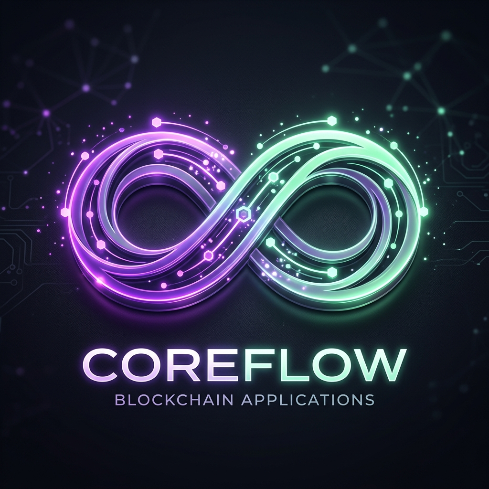
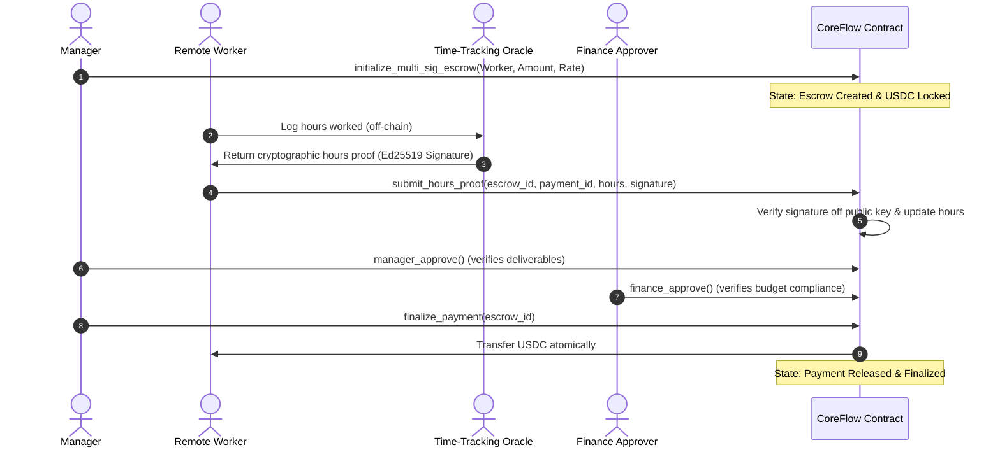

<div align="center">



# CoreFlow

### On-Chain Accounts Payable for Remote Teams

[](https://stellar.org)
[](https://soroban.stellar.org)
[](https://nextjs.org)
[](LICENSE)

<br />

**CoreFlow** is a decentralized accounts payable platform that brings **multi-signature escrow**, **oracle-verified time tracking**, and **automated payment releases** to the Stellar blockchain — purpose-built for remote teams and distributed organizations.

<br />

[Getting Started](#-getting-started) · [How It Works](#-how-it-works) · [Smart Contract](#-smart-contract-soroban) · [Frontend](#-frontend-nextjs-14) · [Deploy](#-deployment-to-stellar-testnet) · [Architecture Deep Dive](#-architecture-deep-dive) · [Design System](#-design-system)

</div>

---

> [!IMPORTANT]
> **🚀 Stellar Mainnet Live Contract**
> - **Contract ID**: `CCTF5WBOQR7JP2KPLQT372X7JCGCINHDFRSAPF4YTYRKZXZ3J2XPRFFW`
> - **Deployer (Manager) Address**: `GBPLBGLHRDLWGA4XXIQOHCQXP23EN4IPJBCOTZ7KRDJXM5Y7YKPIL3SG`
> - **WASM Hash**: `1ed0b9d99371d970b08cf74f3ff7c447721d6f01c1a3ba78d29645ab29999cee`
> - **Network**: Stellar Public Network (Mainnet)

## 🎥 5-Minute Demo Script (For Judges)

1. **Freighter Wallet Connection**
   - Click **Connect Wallet** in the top right. Select your Freighter wallet (ensure it is configured for **Mainnet**).
   - Your balance and address will be read live from the Stellar mainnet ledger.
2. **Dashboard Overview**
   - View the live dashboard containing the **Impact Tracker** (cumulative savings vs bank wires, PHP conversions at live rates, total processed) and the live transaction feed.
3. **Escrow Initialization**
   - Click **Initialize Escrow**. Input a Worker's Stellar address, USDC amount (e.g. 0.5 USDC for tiny-fee mainnet testing), and hourly rate. Submit the transaction to deploy a secure escrow account on-chain.
4. **Oracle Hours Proof**
   - Click **Submit Hours**. Input the Escrow ID, payment schedule index, and logged hours. The oracle signs this proof with an Ed25519 private key, which is cryptographically verified by the smart contract before updating the payment hours.
5. **On-Chain approvals**
   - Under the active escrow, review the status timeline: `Deposited ➔ Hours Verified ➔ Manager Approved ➔ Finance Approved ➔ Released`.
   - Click **Approve (Manager)** and **Approve (Finance)** to sign the multi-signature approvals.
6. **Finalize and Download Receipt**
   - Click **Finalize Payment**. Funds are released instantly on-chain from the escrow contract to the worker.
   - Show the **Fee Savings** popup detailing the 5%+ saved compared to traditional banking.
   - Click **Download Receipt** to get a signed payment record.

---

## 📋 Table of Contents

- [The Problem](#-the-problem)
- [The Solution](#-the-solution)
- [Target Users](#-target-users)
- [Core Features](#-core-features)
- [Tech Stack](#%EF%B8%8F-tech-stack)
- [Project Structure](#-project-structure)
- [Getting Started](#-getting-started)
- [How It Works](#-how-it-works)
- [Smart Contract (Soroban)](#-smart-contract-soroban)
- [Frontend (Next.js 14)](#-frontend-nextjs-14)
- [Deployment to Stellar Testnet](#-deployment-to-stellar-testnet)
- [Environment Variables](#-environment-variables)
- [Development](#-development)
- [Architecture Deep Dive](#-architecture-deep-dive)
- [Gas Optimization Case Study](#-gas-optimization-case-study)
- [Why Stellar & Soroban?](#-why-stellar--soroban)
- [Market Sizing](#-market-sizing)
- [Go-to-Market (GTM) Strategy](#-go-to-market-gtm-strategy)
- [Ecosystem Growth](#-ecosystem-growth)
- [Design System](#-design-system)
- [Security Considerations](#-security-considerations)
- [Troubleshooting](#-troubleshooting)
- [References](#-references)

---

## ⚠️ The Problem: The High Cost of Trust in Remote Work

The massive rise in global remote work and international outsourcing has outpaced the cross-border payment infrastructure designed for the legacy era. Organizations deploying capital to remote talent pools—particularly in emerging markets like Southeast Asia (SEA)—face a complex matrix of friction points that drain resources, slow execution, and introduce counterparty risk:

1. **Predatory Transaction Fees & FX Spreads:** International SWIFT transfers route through multiple intermediary correspondent banks. Each bank extracts a fee, resulting in total transaction costs ranging from **3% to 8%** of the invoice amount. Remote workers bear the brunt of these fees and are further penalized by sub-optimal foreign exchange rates and hidden currency conversion spreads.
2. **Settlement Delays & Working Capital Lockup:** Traditional bank wires require **3 to 5 business days** to clear. For remote freelancers and small outsourcing agencies operating on tight cash flows, these delays create operational friction and financial instability.
3. **Counterparty Risk & The "Escrow Dilemma":** Remote workers face the risk of non-payment after delivering work, while employers fear paying for sub-standard or incomplete work. Centralized escrow services (like Upwork or Escrow.com) charge high fees (**5% to 20%**), eroding contractor margins.
4. **Compliance & Manual Accounts Payable Overhead:** Finance teams spend hundreds of hours manually matching invoices, verifying hours from time-trackers, routing approvals via email, and reconciling international bank reports. This high administrative overhead costs companies an average of **$15 to $40 per invoice** (Strategic Resource Management, 2024) and increases the risk of invoice fraud, which affects 79% of global B2B organizations.

---

## 🟢 The Solution: CoreFlow On-Chain Accounts Payable

**CoreFlow** solves these structural bottlenecks by bringing **trustless multi-signature escrow**, **cryptographically verified hours logging**, and **automated atomic settlements** to the Stellar blockchain. 

By utilizing Stellar’s high-speed, ultra-low-fee network and Soroban smart contracts, CoreFlow replaces slow, centralized middle-men with transparent, programmatic covenants:

| Legacy Accounts Payable | CoreFlow Decentralized AP |
|---|---|
| 3–5 day correspondent banking wires | **Near-instant (5-second)** on-chain settlement |
| High fees (**3–8%** wire fees + FX spreads) | **Near-zero fees** (<$0.01 per transaction on Stellar) |
| Centralized escrow brokers charging **5–20%** | **Trustless on-chain escrow** with 0% middleman fee |
| Manual time tracking spreadsheets | **Oracle-verified hours** with Ed25519 cryptography |
| Emailed approvals & invoice verification | **Multi-signature approvals** (Manager + Finance) |
| Siloed, paper-based audit trails | **Immutable, transparent on-chain history** |

> **The CoreFlow Workflow:** Workers submit cryptographically signed hour proofs ➔ The smart contract verifies the proof ➔ Managers and Finance Approvers sign on-chain approvals ➔ USDC is instantly released from escrow.

---

## 🎯 Target Users

| User | Role |
|---|---|
| **Remote-first startups** | Pay distributed teams across borders without bank friction |
| **DAOs & Web3 organizations** | Govern treasury payouts with multi-sig approval flows |
| **Freelancer collectives** | Transparent escrow for milestone-based contracts |
| **Finance teams** | Auditable, compliant payment workflows with full on-chain history |

---

## ✨ Core Features

| Feature | Description |
|---|---|
| 🔐 **Multi-Signature Escrow** | Requires both Manager and Finance approval before any payment is released |
| 🧾 **Oracle-Verified Time Tracking** | Ed25519-signed hours proof from time-tracking systems (oracle pattern) |
| 💳 **Payment Schedules** | Support for multiple workers, recurring payments, and batch processing |
| 🏦 **Freighter Wallet Integration** | Native Stellar wallet connect with simulate-before-submit UX |
| 📊 **Real-Time Dashboard** | Live payment status, approval progress, and transaction feed |
| ✅ **Read-Only Simulations** | Preview transaction costs and results without mutating chain state |
| 🌐 **Testnet & Mainnet Ready** | One config toggle to switch between networks |

---

## 🛠️ Tech Stack

| Layer | Technology | Purpose |
|---|---|---|
| **Smart Contract** | Rust + Soroban SDK | On-chain escrow logic, multi-sig, oracle verification |
| **Frontend** | Next.js 14 (App Router) | Dashboard UI with server/client components |
| **Styling** | Tailwind CSS 3 | Dark-mode glassmorphism design system |
| **Wallet** | Stellar Freighter | Browser extension for transaction signing |
| **Blockchain** | Stellar Network (Soroban) | Fast, low-cost smart contract execution |
| **Components** | shadcn/ui + Lucide Icons | Accessible, composable UI primitives |
| **Language** | TypeScript | Type-safe frontend development |

---

## 📁 Project Structure

```
coreflow/
├── contracts/
│   └── core-flow/
│       ├── src/
│       │   ├── lib.rs              # Smart contract implementation
│       │   └── test.rs             # Unit tests (happy path + failure cases)
│       ├── Cargo.toml              # Rust dependencies
│       └── Cargo.lock
├── src/
│   ├── app/
│   │   ├── layout.tsx              # Root layout (Outfit font, metadata)
│   │   ├── globals.css             # Global styles + design tokens
│   │   └── dashboard/
│   │       └── page.tsx            # Main dashboard UI
│   ├── lib/
│   │   ├── config.ts               # Stellar network & wallet config
│   │   └── contracts.ts            # CoreFlowClient (simulate + submit)
│   └── components/
│       ├── WalletButton.tsx         # Freighter wallet connect/disconnect
│       ├── EscrowCard.tsx           # Payment escrow card with approvals
│       ├── TransactionFeed.tsx      # Activity feed (on-chain transactions)
│       ├── Button.tsx               # Styled button component
│       ├── Card.tsx                 # Glassmorphism card container
│       └── Alert.tsx                # Status alert component
├── .env.example                     # Environment variable template
├── deploy.sh                        # Linux/Mac deployment script
├── deploy.ps1                       # Windows deployment script
├── DESIGN_SYSTEM.md                 # Complete design system documentation
├── IMPLEMENTATION_GUIDE.md          # Component before/after examples
├── package.json                     # Frontend dependencies & scripts
├── tailwind.config.js               # Tailwind CSS configuration
├── tsconfig.json                    # TypeScript configuration
└── next.config.ts                   # Next.js configuration
```

---

## 🚀 Getting Started

### Prerequisites

| Tool | Version | Installation |
|---|---|---|
| **Node.js** | 18+ | [nodejs.org](https://nodejs.org) |
| **Rust** | Latest stable | [rustup.rs](https://rustup.rs) |
| **wasm32 target** | — | `rustup target add wasm32-unknown-unknown` |
| **Stellar CLI** | Latest | [stellar/stellar-cli](https://github.com/stellar/stellar-cli) |
| **Freighter Wallet** | Latest | [freighter.app](https://www.freighter.app/) |

### Step 1 — Install Dependencies

```bash
# Frontend dependencies
npm install

# Rust contract dependencies
cd contracts/core-flow && cargo fetch && cd ../..
```

### Step 2 — Configure Environment

```bash
cp .env.example .env.local
```

Edit `.env.local` with your values:

```env
# Network: testnet or public
NEXT_PUBLIC_STELLAR_NETWORK=testnet

# Read-only address for simulations (any valid testnet address)
NEXT_PUBLIC_STELLAR_READ_ADDRESS=GBRPYHIL2CI3FZJ...

# Your deployed contract ID (see Deployment section)
NEXT_PUBLIC_STELLAR_CONTRACT_ID=CAU3FQTWCAFJF4X...
```

### Step 3 — Build the Smart Contract

```bash
npm run contract:build
```

### Step 4 — Run the Development Server

```bash
npm run dev
```

Open **[http://localhost:3000/dashboard](http://localhost:3000/dashboard)** in your browser.

---

## 🔄 How It Works

CoreFlow implements a **5-step on-chain workflow** for paying remote workers:

```
┌─────────────┐    ┌─────────────┐    ┌─────────────┐    ┌─────────────┐    ┌─────────────┐
│   Step 1    │    │   Step 2    │    │   Step 3    │    │   Step 4    │    │   Step 5    │
│             │───▶│            │───▶│             │───▶│            │───▶│             │
│  Initialize │    │   Submit    │    │  Manager    │    │  Finance    │    │  Finalize   │
│   Escrow    │    │   Hours     │    │  Approval   │    │  Approval   │    │  Payment    │
│             │    │   Proof     │    │             │    │             │    │             │
└─────────────┘    └─────────────┘    └─────────────┘    └─────────────┘    └─────────────┘
    Manager           Worker +           Manager           Finance           Manager
  creates escrow    Oracle signs      approves on-chain  approves on-chain  releases USDC
  with schedules    hours data        via Freighter      via Freighter      to worker
```

### Detailed Flow

| Step | Actor | Action | Contract Function |
|---|---|---|---|
| **1. Initialize** | Manager | Creates escrow with worker addresses, amounts, and payment schedules | `initialize_multi_sig_escrow()` |
| **2. Hours Proof** | Worker | Submits oracle-signed hours data (Ed25519 signature verification) | `submit_hours_proof()` |
| **3. Manager Approve** | Manager | Reviews hours and approves payment via Freighter wallet | `manager_approve()` |
| **4. Finance Approve** | Finance | Reviews budget and approves payment via Freighter wallet | `finance_approve()` |
| **5. Finalize** | Manager | Both approvals confirmed → USDC released to worker | `finalize_payment()` |

> **Simulate before Submit:** Every write transaction is first simulated using a read-only address (`NEXT_PUBLIC_STELLAR_READ_ADDRESS`) to preview gas costs and catch errors — without mutating chain state.

---

## 📜 Smart Contract (Soroban)

### Architecture

The `CoreFlowContract` is a Rust-based Soroban smart contract implementing:

- **Multi-signature escrow** — Dual approval (Manager + Finance) before payment release
- **Payment schedules** — `Vec<PaymentSchedule>` supporting multiple workers and recurring payments
- **Oracle integration** — Ed25519 signature validation for external time-tracking data
- **State management** — Persistent on-chain storage of all escrow and payment state

### Contract Functions

```rust
// Create a new multi-sig escrow with payment schedules
initialize_multi_sig_escrow(
    manager: Address,
    finance_approver: Address,
    payments: Vec<PaymentSchedule>,
) -> Result<u32, u32>

// Submit oracle-signed hours proof for a payment
submit_hours_proof(
    escrow_id: u32,
    payment_id: u32,
    hours_logged: i128,
    signature: Bytes,              // Ed25519 signature (≥64 bytes)
) -> Result<(), u32>

// Manager approves the escrow (requires manager auth)
manager_approve(escrow_id: u32) -> Result<(), u32>

// Finance approves the escrow (requires finance_approver auth)
finance_approve(escrow_id: u32) -> Result<(), u32>

// Release payment after both approvals (requires manager auth)
finalize_payment(escrow_id: u32) -> Result<Vec<PaymentSchedule>, u32>

// Read escrow details (no auth required)
get_escrow(escrow_id: u32) -> Result<CoreFlowEscrow, u32>
```

### Error Codes

| Code | Name | Description |
|---|---|---|
| `1` | `AlreadyApproved` | This party has already approved the escrow |
| `2` | `Unauthorized` | Caller is not authorized for this action |
| `3` | `InvalidOracleSignature` | Oracle signature is invalid or too short |
| `4` | `InvalidPaymentId` | Payment or escrow ID does not exist |
| `5` | `InsufficientApprovals` | Both approvals are required before finalization |
| `6` | `PaymentAlreadyFinalized` | This payment has already been released |
| `7` | `InvalidAmount` | Amount is invalid (e.g., empty payment schedules) |

### Running Tests

```bash
npm run contract:test
```

**Test coverage:**

- ✅ Full happy path: Initialize → Hours Proof → Manager Approve → Finance Approve → Finalize
- ✅ Invalid oracle signature rejection (signature < 64 bytes)
- ✅ Finalization fails without both approvals (`InsufficientApprovals`)
- ✅ Double approval prevention (`AlreadyApproved`)

---

## 🖥️ Frontend (Next.js 14)

### Configuration Module

The [`src/lib/config.ts`](src/lib/config.ts) module provides:

| Capability | Details |
|---|---|
| **Network config** | Testnet / Mainnet toggle via environment variable |
| **RPC endpoints** | Auto-selected based on network (`soroban-testnet.stellar.org`) |
| **Freighter helpers** | `connect()`, `signTransaction()`, `signMessage()`, `isConnected()` |
| **Read address** | `NEXT_PUBLIC_STELLAR_READ_ADDRESS` for gas-free simulations |

### CoreFlowClient

The [`src/lib/contracts.ts`](src/lib/contracts.ts) implements the **Simulate → Submit** pattern:

```typescript
const client = new CoreFlowClient();

// 1. Simulate (read-only, no wallet signing needed)
const sim = await client.simulateManagerApprove(escrowId);

// 2. Submit (Freighter signs + broadcasts to network)
const result = await client.submitManagerApprove(escrowId);
console.log(result.transactionHash); // On-chain tx hash
```

**Available methods:**

| Method | Type | Description |
|---|---|---|
| `simulateManagerApprove()` | Read | Preview manager approval (gas estimate) |
| `simulateFinanceApprove()` | Read | Preview finance approval (gas estimate) |
| `submitManagerApprove()` | Write | Sign & submit manager approval via Freighter |
| `submitFinanceApprove()` | Write | Sign & submit finance approval via Freighter |
| `getEscrow()` | Read | Fetch escrow details from chain |

### Dashboard UI

The [`src/app/dashboard/page.tsx`](src/app/dashboard/page.tsx) provides:

- **Wallet Connection** — Connect/disconnect Freighter with address display
- **Stats Grid** — Total escrows, pending review, ready to release, released
- **Escrow Cards** — Per-escrow detail cards with approval progress timeline
- **Action Buttons** — Manager Approve, Finance Approve, and Finalize Payment
- **Transaction Feed** — Real-time activity log with transaction hashes
- **Error Handling** — User-friendly alerts for failed transactions

---

## 🌐 Deployment to Stellar Testnet

### Step 1 — Fund Your Testnet Account

1. Open [Stellar Friendbot](https://friendbot.stellar.org)
2. Enter your Freighter wallet public key
3. Verify funding at [Stellar Expert](https://stellar.expert/explorer/testnet)

### Step 2 — Generate a Stellar CLI Identity

```bash
stellar keys generate --name coreflow
```

### Step 3 — Build & Deploy

**Linux / macOS:**
```bash
bash deploy.sh
```

**Windows (PowerShell):**
```powershell
.\deploy.ps1
```

**Manual deployment:**
```bash
# Build the contract
npm run contract:build

# Deploy to testnet
stellar contract deploy \
  --network testnet \
  --source coreflow \
  --wasm ./contracts/core-flow/target/wasm32-unknown-unknown/release/core_flow.wasm
```

### Step 4 — Update Configuration

Copy the contract ID from the deployment output and update `.env.local`:

```env
NEXT_PUBLIC_STELLAR_CONTRACT_ID=<your-deployed-contract-id>
```

### Step 5 — Launch

```bash
npm run dev
```

Navigate to **[http://localhost:3000/dashboard](http://localhost:3000/dashboard)** and connect your Freighter wallet.

---

## 🔑 Environment Variables

| Variable | Description | Required |
|---|---|---|
| `NEXT_PUBLIC_STELLAR_NETWORK` | Network to use (`testnet` or `public`) | ✅ |
| `NEXT_PUBLIC_STELLAR_READ_ADDRESS` | Read-only address for simulations (no signing authority needed) | ✅ |
| `NEXT_PUBLIC_STELLAR_CONTRACT_ID` | Deployed CoreFlow contract address | ✅ |
| `NEXT_PUBLIC_FREIGHTER_TIMEOUT` | Wallet connection timeout in ms (default: `5000`) | ❌ |

> All `NEXT_PUBLIC_*` variables are safe to expose client-side per Next.js conventions.

---

## 💻 Development

### Available Scripts

| Command | Description |
|---|---|
| `npm run dev` | Start Next.js development server |
| `npm run build` | Build production bundle |
| `npm run start` | Start production server |
| `npm run lint` | Run ESLint |
| `npm run contract:build` | Build Soroban smart contract (Rust → WASM) |
| `npm run contract:test` | Run smart contract unit tests |

### Quick Start

```bash
npm install              # Install frontend dependencies
npm run contract:build   # Build the smart contract
npm run contract:test    # Verify tests pass
npm run dev              # Start dev server at localhost:3000
```

---

## 🏗️ Architecture Deep Dive

CoreFlow is designed to support high-throughput, enterprise-grade B2B accounts payable. It splits operations between a decentralized frontend dashboard and a Rust-based Soroban smart contract ecosystem.

### 1. Trustless Multi-Signature Escrow Mechanism
Rather than relying on central custodians, funds are locked directly in the smart contract's state when an escrow is initialized. 
- **Initialization**: The manager deploys the escrow, specifies the `finance_approver` address, and populates the `PaymentSchedule` array. The manager deposits the required assets (e.g., USDC) into the escrow contract.
- **Proof of Work (Oracle verification)**: A worker logs hours in an external time-tracker (like JIRA, Hubstaff, or a custom tool). When a payment milestone is reached, an oracle (such as Chainlink or a designated validator node) signs a cryptographic hours payload with an Ed25519 private key. The worker submits this signature via `submit_hours_proof()`. The contract recovers the public key and verifies that the signature matches the reported hours.
- **Dual-Approval Flow**: The contract enforces a strict **Segregation of Duties (SoD)** corporate control. The `manager` must call `manager_approve()` to sign off on work quality, and the `finance_approver` must call `finance_approve()` to verify budget compliance.
- **Atomic Settlement**: Once both approvals are flagged in the contract's instance state, the manager calls `finalize_payment()`, which atomically updates the statuses and triggers the transfer of assets to the worker.



### 2. Factory Pattern for Enterprise Scalability
A naive smart contract design would use a single global contract that stores all escrows for every company on the network. However, on Soroban, transaction fees are heavily dependent on **Ledger Footprint Size** (the amount of data read and written from the global ledger state). Under a unified global contract, database keys grow exponentially, leading to:
- State bloat.
- High memory usage during transaction simulations.
- Increased risk of storage key conflicts.

To solve this, CoreFlow utilizes the **Factory Pattern**:
1. **Master Deployer (Factory)**: A lightweight deployer contract is deployed once to the Stellar network.
2. **Dynamic Instantiation**: When a new organization signs up for CoreFlow, they call the Factory. The Factory uses the `env.deployer()` API to programmatically deploy a new, dedicated instance of the CoreFlow escrow contract.
3. **State Isolation**: Each company gets a separate contract address with its own storage space. This keeps the ledger footprint small and isolated, ensuring that Organization A's transactions never compete with or read/write Organization B's database entries.
4. **Independent Upgradability**: Organization instances can be upgraded individually to newer contract versions without disrupting other companies on the platform.

---

## ⚡ Gas Optimization Case Study: Batch Payouts (`pay_batch`)

To demonstrate CoreFlow's technical execution on Stellar, we analyzed and optimized the pay-run flow. When a company pays its team, calling `finalize_payment` separately for each employee would incur high gas and signature fees. We implemented a batching pattern to group multiple employee payouts in a single transaction.

### Simplified Optimized Batch Function (Rust / Soroban)

```rust
#[contractimpl]
impl CoreFlowContract {
    /// Finalizes multiple escrows atomically in a single ledger transaction.
    /// This drastically minimizes CPU instructions and transaction size.
    pub fn pay_batch(
        env: Env,
        escrow_ids: Vec<u32>,
    ) -> Result<(), ContractError> {
        // 1. Single-Signature Verification (Amortized Auth)
        // Verify manager authorization once for the entire batch.
        let manager: Address = env.storage().instance().get(&DataKey::Manager)
            .ok_or(ContractError::Unauthorized)?;
        manager.require_auth();

        // 2. Iterate and process escrows in memory
        for id in escrow_ids.iter() {
            let mut escrow: CoreFlowEscrow = env.storage().instance().get(&DataKey::Escrow(id))
                .ok_or(ContractError::InvalidPaymentId)?;

            if escrow.cancelled {
                return Err(ContractError::EscrowCancelled);
            }

            // Dual signatures must be set on-chain prior to batch execution
            if !escrow.manager_approved || !escrow.finance_approved {
                return Err(ContractError::InsufficientApprovals);
            }

            let mut total_payout: i128 = 0;
            let mut finalized_payments = Vec::new(&env);

            for i in 0..escrow.payments.len() {
                let mut payment = escrow.payments.get(i).unwrap();
                if payment.status == PaymentStatus::Pending {
                    payment.status = PaymentStatus::Finalized;
                    total_payout += payment.amount;
                }
                finalized_payments.push_back(payment);
            }

            escrow.payments = finalized_payments;
            
            // 3. Write back state once
            env.storage().instance().set(&DataKey::Escrow(id), &escrow);

            // 4. Extend TTL to avoid archival
            env.storage().instance().extend_ttl(INSTANCE_TTL_THRESHOLD, INSTANCE_TTL_EXTEND);

            // 5. Emit a single event for tracking
            env.events().publish(
                (symbol_short!("batch"), symbol_short!("release")),
                (id, total_payout),
            );
        }

        Ok(())
    }
}
```

### Soroban Gas Minimization Strategies Used:

1. **Amortized Signature Verification**: In Soroban, cryptography (cryptographic signature checks) is one of the most CPU-intensive operations. By using `manager.require_auth()` once at the top of `pay_batch`, we pay the signature verification fee **only once** for the entire batch of payments, rather than `N` times.
2. **Optimized Storage Class Selection**: Soroban has three storage classes: *Persistent*, *Temporary*, and *Instance*. We store escrow configurations and active payments in **Instance Storage** because they are coupled with the contract instance. By calling `extend_ttl`, we proactively extend the ledger lifetime of the keys during active billing cycles, preventing the expensive fees associated with restoring archived entries.
3. **Contiguous Vector Packing**: Instead of writing separate storage entries for each individual payment schedule (which would trigger multiple storage read/write CPU instructions), we store schedules in a single contiguous `Vec<PaymentSchedule>` inside `CoreFlowEscrow`. Reading and writing one single serialized object reduces the ledger footprint charge.
4. **WASM Bytecode Optimization**: We configure our `Cargo.toml` with release profiles:
   - `opt-level = "z"` (optimizes for size, shrinking bytecode size).
   - `lto = true` (link-time optimization).
   - `codegen-units = 1` (improves optimization passes).
   This reduces the WASM deployment footprint, lowering the initial loading gas fee when the contract VM is cold-started on a ledger validator.

---

## 🚀 Why Stellar & Soroban?

When building a high-volume, cross-border B2B Accounts Payable system, choosing the correct blockchain is a critical business and technical decision. Stellar and Soroban outperform EVM chains (Ethereum, Arbitrum) and Solana on key parameters:

| Metric / Feature | Stellar (Soroban) | EVM L2s (Arbitrum, Optimism) | Solana |
|---|---|---|---|
| **Fiat Off-Ramps & Anchor Network** | **Industry Leader (SEP-24 / SEP-31)**. Direct integration with domestic banking systems (e.g., GCash & Coins.ph in PH) without central exchanges. | None native. Requires users to bridge assets to centralized exchanges or use expensive, fragmented L2 fiat gateways. | Limited compliance frameworks. Relies on unregulated local OTC desks or exchange integrations. |
| **Fee Predictability** | **Ultra-Stable & Low**. Programmatic fee models prevent gas fee spikes. A typical transaction costs `<$0.0001`. | Vulnerable to gas spikes during L1 congestion or rollup submission bottlenecks, making corporate payouts unpredictably expensive. | Very cheap, but fee dynamics are volatile under priority pricing and transaction drops occur during high network congestion. |
| **Compliance Infrastructure** | **First-Class Primitive**. Built-in asset controls, clawback mechanisms, and standardized KYC (SEP-12) APIs. | Requires custom smart contracts (e.g., custom ERC-20 wrappers) which introduces substantial attack surfaces and audit costs. | Token Extensions exist, but lack standardized enterprise-grade integration frameworks for business payroll compliance. |
| **Smart Contract Security** | **Rust-based, Sandboxed VM**. Zero reentrancy vectors by design. Strict state separation prevents standard Solidity exploits. | High risk. EVM contracts are prone to reentrancy attacks, flash loan exploits, and complex compiler vulnerabilities. | Rust-based but complex memory ownership models (`AccountInfo` validation loops) that are historically error-prone. |

---

## 📊 Market Sizing (Southeast Asia & Philippines)

CoreFlow is positioned to capture a high-growth cross-border payment corridor in Southeast Asia (SEA), starting with the Philippines:

* **The Freelancer & Remote Agency Boom**: The Philippines is one of the top outsourcing hubs globally, with over **1.5 Million remote workers and freelancers** contributing to the digital gig economy.
* **B2B Outsourcing Volume**: The Philippine IT-BPM (Information Technology and Business Process Management) industry generated **$35.5 Billion** in revenue in 2023. A massive portion of this flow consists of cross-border B2B payouts from the US, UK, and Australia.
* **High Transaction Costs**: Out of this $35.5B, businesses lose an estimated **$1.06 Billion annually** to correspondent banking fees, processing overhead, and foreign exchange spreads (assuming average transaction fees of 3%).
* **CoreFlow's Serviceable Addressable Market (SAM)**: By targeting 1% of the outsourcing agency and freelancer market in the Philippines, CoreFlow's initial SAM is **$350 Million** in annual transaction volume, which translates to saving remote agencies over **$10 Million** in fee overhead.

---

## 🎯 Go-to-Market (GTM) Strategy

We have structured a practical, 3-phase rollout plan designed to drive volume and build immediate utility:

```
┌─────────────────────────────────┐      ┌─────────────────────────────────┐      ┌─────────────────────────────────┐
│     Phase 1: Local Pilot        │      │    Phase 2: Regional Scaling    │      │    Phase 3: Global Platform     │
│          (Months 1-6)           │─────▶│          (Months 6-18)          │─────▶│          (Months 18+)           │
│                                 │      │                                 │      │                                 │
│  - Launch pilot in Philippines  │      │  - Expand to Vietnam & Indonesia│      │  - Full-stack enterprise suite  │
│  - Partner with dev agencies    │      │  - Deep SEP-24 anchor integrations│     │  - Automated tax/compliance API │
│  - Direct USDC feedback loops   │      │  - Launch multi-currency pools  │      │  - Integrations (QuickBooks)    │
└─────────────────────────────────┘      └─────────────────────────────────┘      └─────────────────────────────────┘
```

1. **Phase 1: Freelancer & Agency Pilot (Months 1–6)**
   - Target: Philippine-based boutique software development shops, creative agencies, and remote worker collectives.
   - Objective: Pilot our oracle-verified time tracking and automated USDC escrow releases. Work directly with users to refine the Freighter wallet UX.
2. **Phase 2: Regional Expansion & Anchor Integration (Months 6–18)**
   - Target: High-growth remote corridors in Southeast Asia (Vietnam, Indonesia, Thailand, Malaysia).
   - Objective: Partner with Stellar SEP-24 anchors (like Coins.ph, GCash, or local bank integrations) to enable freelancers to off-ramp USDC directly to their local mobile wallets or bank accounts for under 1%.
3. **Phase 3: Global Enterprise Accounts Payable Suite (Months 18+)**
   - Target: Global companies employing international teams.
   - Objective: Integrate automated local tax compliance calculations, multi-currency pools (USDC, EURC, GYEN), and direct accounting sync APIs (Xero, QuickBooks) to offer a complete Web2-to-Web3 corporate payroll solution.

---

## 📈 Ecosystem Growth

CoreFlow is not just a utility tool; it acts as a direct growth multiplier for the Stellar ecosystem:

* **Driving Real-World Asset (RWA) Velocity**: CoreFlow locks USDC and EURC in on-chain escrows and distributes them to workers, creating a constant, non-speculative transactional velocity on Stellar Mainnet.
* **Incentivizing Anchor Network Expansion**: As CoreFlow scales, the increased demand for cheap local currency conversion will drive higher transaction volumes through local SEP-24/31 anchors, encouraging new financial institutions in SEA to build on Stellar.
* **Developer and Enterprise Adoption**: By showcasing a fully optimized, audited Soroban smart contract repository utilizing the factory pattern and oracle signatures, CoreFlow establishes a design pattern that other B2B developers can replicate on Stellar.
* **Financial Inclusion for Gig Workers**: CoreFlow integrates gig workers directly into the Stellar network, giving them access to stablecoins, decentralized lending protocols, and global financial rails without requiring access to traditional high-fee bank transfers.

---

---

## 🎨 Design System

CoreFlow implements a **premium dark-mode Web3 dashboard** aesthetic with:

- **Glassmorphism** — `backdrop-blur-lg` + semi-transparent gradient surfaces
- **Color-coded status** — Emerald (success), Amber (pending), Blue (action), Red (error)
- **Gradient text** — Eye-catching metric numbers with directional color gradients
- **Hover elevation** — Cards lift on hover with enhanced shadows and border glow
- **Outfit font** — Modern geometric sans-serif (weights: 400, 500, 600, 700)
- **WCAG AA+ accessibility** — All text/background combinations exceed 8:1 contrast

| Text | Background | Contrast | Grade |
|---|---|---|---|
| `slate-100` | `slate-950` | 15.2:1 | AAA ✅ |
| `slate-300` | `slate-900` | 8.1:1 | AA ✅ |
| `emerald-400` | `slate-950` | 9.3:1 | AAA ✅ |
| `amber-400` | `slate-950` | 10.5:1 | AAA ✅ |

📖 **Full documentation:**
- [DESIGN_SYSTEM.md](DESIGN_SYSTEM.md) — Complete color palette, typography, depth system, component patterns
- [IMPLEMENTATION_GUIDE.md](IMPLEMENTATION_GUIDE.md) — Before/after code examples for every component

---

## 🔒 Security Considerations

| Area | Guidance |
|---|---|
| **Private Keys** | Never commit `.env.local` or private keys — use `.gitignore` |
| **Freighter** | Always review transaction details in the Freighter popup before signing |
| **Contract Audits** | This is a bootcamp project — conduct a professional security audit before mainnet |
| **Rate Limiting** | Add rate limits to any API endpoints before production deployment |
| **Read Address** | The `NEXT_PUBLIC_STELLAR_READ_ADDRESS` has no signing authority — it's safe to expose |

---

## 🔧 Troubleshooting

<details>
<summary><strong>Contract build fails</strong></summary>

```bash
# Ensure wasm32 target is installed
rustup target add wasm32-unknown-unknown

# Clear cargo cache and rebuild
cd contracts/core-flow
cargo clean
cargo build --target wasm32-unknown-unknown --release
```
</details>

<details>
<summary><strong>Freighter wallet won't connect</strong></summary>

1. Verify Freighter is installed: [freighter.app](https://www.freighter.app/)
2. Switch Freighter to **Testnet** in wallet settings
3. Ensure your account is funded via [Friendbot](https://friendbot.stellar.org)
4. Refresh the browser page and try again
</details>

<details>
<summary><strong>Transaction simulation fails</strong></summary>

- Verify `NEXT_PUBLIC_STELLAR_READ_ADDRESS` is a valid, funded testnet address
- Confirm the network in `.env.local` matches your Freighter wallet network
- Check that the contract is deployed and the contract ID is correct
- Review browser console for detailed error messages
</details>

<details>
<summary><strong>js-stellar-sdk import errors</strong></summary>

```bash
# Install the Stellar SDK
npm install js-stellar-sdk@10

# Restart the dev server
npm run dev
```
</details>

---

## References

### Research Studies
- ACI Worldwide. (2024). *Cross-border payments: The journey to speed, transparency, and lower costs*.
- Convera. (2024). *B2B cross-border payments report: Navigating fraud and compliance*.
- SRM (Strategic Resource Management). (2024). *The hidden costs of cross-border payments and repair fees*.
- The Payments Association. (2024). *The future of cross-border payments: Projected market growth to 2032*.

### Technical Documentation
| Resource | Link |
|---|---|
| Stellar Freighter Integration Guide | [GitHub](https://github.com/armlynobinguar/Stellar-Bootcamp-2026/blob/main/STELLAR_FREIGHTER_INTEGRATION_GUIDE.md) |
| Soroban Documentation | [developers.stellar.org](https://developers.stellar.org/docs/learn/soroban) |
| js-stellar-sdk | [GitHub](https://github.com/nicktomlin/js-stellar-sdk) |
| Next.js Documentation | [nextjs.org/docs](https://nextjs.org/docs) |
| Stellar Bootcamp 2026 | [GitHub](https://github.com/armlynobinguar/Stellar-Bootcamp-2026) |

---

#Video Demo Link

https://github.com/user-attachments/assets/69dc75e8-108a-45c7-b93d-91fbfce375b7

---

<div align="center">

**Built with ❤️ for [Stellar Philippines Bootcamp 2026](https://github.com/armlynobinguar/Stellar-Bootcamp-2026)**

*On-chain transparency for the future of work.*

</div>
