# CoreFlow Payment State Machine

**16 states · 38 declared transitions.** The tables below are generated from
`src/lib/payments/state-machine.ts`, which is the single source of truth. If they
disagree with the code, the code is right and this document is stale.

---

## 1. The one rule that matters

> **Only a chain observer may move a payment to `PAID`.**

There is no user-initiated path to `PAID`, and no system-initiated one. The only
actors that can assert settlement are the **indexer** (reading the contract's
event log) and the **reconciler** (reading live contract state). Everything else
— a route handler, an optimistic UI update, a retry — is structurally incapable
of it.

Two corollaries that are easy to get wrong, so they are named explicitly:

- **`SUBMITTING` is not paid.** A transaction has been built and signed. It may
  never reach the network.
- **`CONFIRMING` is not paid.** The network accepted it. It may still fail at
  ledger close.

A payroll product that lets the frontend manufacture "settled" is worse than one
with no status at all, because it is confidently wrong about money.

---

## 2. Chain vs. database authority

| Concern | Authority |
|---|---|
| Token movement, settlement, final transaction result | **Chain** |
| Contract authorization, approvals, oracle verification | **Chain** |
| Organizations, projects, workers, CSV provenance | Database |
| Workflow metadata, search, filtering, UX state | Database |
| Audit projection, reconciliation state | Database |

The database is a **projection**. Where the two disagree, the disagreement is
recorded as a `ReconciliationFinding` and surfaced — the losing side is not
quietly rewritten, because overwriting it destroys the only evidence the two ever
diverged.

---

## 3. States

| State | Label | Meaning | Exits | Tx may exist | Needs attention |
|---|---|---|---|---|---|
| `DRAFT` | **Draft** | Not yet submitted. Still editable. | 2 exit(s) | no | no |
| `VALIDATING` | **Validating** | Checking recipient, amount, asset and hours. | 4 exit(s) | no | no |
| `AWAITING_ORACLE` | **Awaiting oracle verification** | Funded on-chain. Waiting for a signed work attestation. | 3 exit(s) | no | no |
| `ORACLE_VERIFIED` | **Work verified** | The contract accepted the oracle attestation for this payment. | 2 exit(s) | yes | no |
| `AWAITING_MANAGER` | **Awaiting manager approval** | Needs the manager’s on-chain signature. | 4 exit(s) | yes | yes |
| `AWAITING_FINANCE` | **Awaiting finance approval** | Manager approved. Needs the separate finance signature. | 4 exit(s) | yes | yes |
| `READY_TO_SETTLE` | **Ready to settle** | Both approvals are on-chain. Settlement can be submitted. | 3 exit(s) | yes | yes |
| `SUBMITTING` | **Submitting to Stellar** | Building and signing the settlement transaction. Not yet paid. | 3 exit(s) | yes | no |
| `CONFIRMING` | **Confirming on Stellar** | Submitted to the network. Awaiting ledger confirmation — not yet paid. | 3 exit(s) | yes | no |
| `PAID` | **Paid** | Settled on-chain and confirmed. Funds reached the recipient. | terminal | yes | no |
| `REJECTED` | **Rejected** | An approver declined this payment. | terminal | no | no |
| `CANCELLED` | **Cancelled** | Cancelled before settlement. Escrowed funds were refunded. | terminal | yes | no |
| `EXPIRED` | **Expired** | The approval or attestation window lapsed before settlement. | terminal | no | yes |
| `SUBMISSION_FAILED` | **Submission failed** | The transaction never reached Stellar. Safe to retry. | 3 exit(s) | no | yes |
| `SETTLEMENT_FAILED` | **Settlement failed** | The transaction reached Stellar and failed. Needs reconciliation before retry. | 3 exit(s) | yes | yes |
| `RECONCILIATION_REQUIRED` | **Reconciliation required** | CoreFlow’s records and the chain disagree. An operator must resolve it. | 4 exit(s) | yes | yes |

**Terminal states:** `PAID`, `REJECTED`, `CANCELLED`, `EXPIRED`. No transition
out of these is declared, and `checkTransition` refuses any attempt with
`TERMINAL`.

**"Tx may exist"** gates transaction display. The UI shows an explorer link only
where this is `yes` AND a hash is actually present — a link on a payment that was
never submitted invites a reader to believe something settled.

---

## 4. Failure states are distinct on purpose

A single generic `FAILED` cannot answer the only question that matters after a
failure: *is it safe to retry?*

| State | What happened | Retry safe? |
|---|---|---|
| `SUBMISSION_FAILED` | Never reached the network — build, simulate, sign or RPC failure | **Yes.** Nothing was submitted, and the on-chain approvals still stand. A user may retry. |
| `SETTLEMENT_FAILED` | Reached the chain and failed there | **Not until reconciled.** What it did on-chain must be established first. Deliberately *not* a user transition. |
| `RECONCILIATION_REQUIRED` | Database and chain disagree | **No.** Requires operator resolution; never cleared automatically. |
| `EXPIRED` | The attestation or approval window lapsed | N/A — terminal. |
| `REJECTED` | An approver declined | N/A — terminal. |
| `CANCELLED` | Cancelled before settlement, custody refunded | N/A — terminal. |

`POST /api/payments/:id/retry` enforces this: called on a `SETTLEMENT_FAILED`
payment it returns **409** with code `RECONCILIATION_FIRST` rather than doing
something riskier than the caller asked for.

---

## 5. Transition diagram

```mermaid
stateDiagram-v2
  DRAFT -->|user| VALIDATING
  DRAFT -->|user| CANCELLED
  VALIDATING -->|system| DRAFT
  VALIDATING -->|indexer/reconciler| AWAITING_ORACLE
  VALIDATING -->|user| REJECTED
  VALIDATING -->|user| CANCELLED
  AWAITING_ORACLE -->|indexer/reconciler| ORACLE_VERIFIED
  AWAITING_ORACLE -->|indexer/reconciler| CANCELLED
  AWAITING_ORACLE -->|system| EXPIRED
  ORACLE_VERIFIED -->|system/indexer| AWAITING_MANAGER
  ORACLE_VERIFIED -->|indexer/reconciler| CANCELLED
  AWAITING_MANAGER -->|indexer/reconciler| AWAITING_FINANCE
  AWAITING_MANAGER -->|user| REJECTED
  AWAITING_MANAGER -->|indexer/reconciler| CANCELLED
  AWAITING_MANAGER -->|system| EXPIRED
  AWAITING_FINANCE -->|indexer/reconciler| READY_TO_SETTLE
  AWAITING_FINANCE -->|user| REJECTED
  AWAITING_FINANCE -->|indexer/reconciler| CANCELLED
  AWAITING_FINANCE -->|system| EXPIRED
  READY_TO_SETTLE -->|user| SUBMITTING
  READY_TO_SETTLE -->|indexer/reconciler| CANCELLED
  SUBMITTING -->|system| CONFIRMING
  SUBMITTING -->|system| SUBMISSION_FAILED
  CONFIRMING -->|indexer/reconciler| PAID
  READY_TO_SETTLE -->|indexer/reconciler| PAID
  SUBMITTING -->|indexer/reconciler| PAID
  CONFIRMING -->|indexer/system| SETTLEMENT_FAILED
  CONFIRMING -->|reconciler/system| RECONCILIATION_REQUIRED
  SUBMISSION_FAILED -->|user| READY_TO_SETTLE
  SUBMISSION_FAILED -->|user| CANCELLED
  SUBMISSION_FAILED -->|reconciler| RECONCILIATION_REQUIRED
  SETTLEMENT_FAILED -->|reconciler/system| RECONCILIATION_REQUIRED
  SETTLEMENT_FAILED -->|indexer/reconciler| PAID
  SETTLEMENT_FAILED -->|reconciler| READY_TO_SETTLE
  RECONCILIATION_REQUIRED -->|reconciler/indexer| PAID
  RECONCILIATION_REQUIRED -->|reconciler| READY_TO_SETTLE
  RECONCILIATION_REQUIRED -->|reconciler| SETTLEMENT_FAILED
  RECONCILIATION_REQUIRED -->|user| CANCELLED
```

---

## 6. Complete transition table

Anything absent from this table is invalid. The test suite enumerates every
undeclared `(from, to)` pair for every actor kind and asserts rejection — a state
machine tested only on its happy paths will happily accept `DRAFT → PAID`.

| From | To | Who may | Why |
|---|---|---|---|
| `DRAFT` | `VALIDATING` | user (OWNER, ADMIN, MANAGER) | Submitted for validation by whoever is preparing the batch. |
| `DRAFT` | `CANCELLED` | user (OWNER, ADMIN, MANAGER) | A draft row is discarded before anything is funded. |
| `VALIDATING` | `DRAFT` | system | Validation failed; the row returns to editable rather than stalling. |
| `VALIDATING` | `AWAITING_ORACLE` | indexer · reconciler | The escrow is funded on-chain. Only the indexer asserts this, because it means custody actually moved. |
| `VALIDATING` | `REJECTED` | user (OWNER, ADMIN, MANAGER, FINANCE) | Declined during review, before funding. |
| `VALIDATING` | `CANCELLED` | user (OWNER, ADMIN, MANAGER) | Withdrawn during review. |
| `AWAITING_ORACLE` | `ORACLE_VERIFIED` | indexer · reconciler | A `hours/submit` event was observed, meaning the contract ACCEPTED an Ed25519 attestation for this payment. Requesting an attestation is not the same as the chain verifying one. |
| `AWAITING_ORACLE` | `CANCELLED` | indexer · reconciler | The escrow was cancelled on-chain; custody refunded. |
| `AWAITING_ORACLE` | `EXPIRED` | system | The attestation window lapsed without a proof. |
| `ORACLE_VERIFIED` | `AWAITING_MANAGER` | system · indexer | Proof in hand; the payment enters the approval chain. |
| `ORACLE_VERIFIED` | `CANCELLED` | indexer · reconciler | The escrow was cancelled on-chain. |
| `AWAITING_MANAGER` | `AWAITING_FINANCE` | indexer · reconciler | An `approve/manager` event was observed. The approval is the on-chain signature, not the API call that prompted it. |
| `AWAITING_MANAGER` | `REJECTED` | user (OWNER, ADMIN, MANAGER) | The manager declined. |
| `AWAITING_MANAGER` | `CANCELLED` | indexer · reconciler | The escrow was cancelled on-chain. |
| `AWAITING_MANAGER` | `EXPIRED` | system | The approval window lapsed. |
| `AWAITING_FINANCE` | `READY_TO_SETTLE` | indexer · reconciler | An `approve/finance` event was observed from the distinct finance key. |
| `AWAITING_FINANCE` | `REJECTED` | user (OWNER, ADMIN, FINANCE) | Finance declined. MANAGER is absent here on purpose: a manager who could exercise the finance decision would collapse the separation of duties. |
| `AWAITING_FINANCE` | `CANCELLED` | indexer · reconciler | The escrow was cancelled on-chain. |
| `AWAITING_FINANCE` | `EXPIRED` | system | The approval window lapsed. |
| `READY_TO_SETTLE` | `SUBMITTING` | user (OWNER, ADMIN, MANAGER, FINANCE) | A settlement transaction is being built and signed. |
| `READY_TO_SETTLE` | `CANCELLED` | indexer · reconciler | The escrow was cancelled before settlement. |
| `SUBMITTING` | `CONFIRMING` | system | The network accepted the transaction; it awaits ledger close. |
| `SUBMITTING` | `SUBMISSION_FAILED` | system | The transaction never reached the network (build, simulate, sign or RPC failure). Nothing was submitted, so a retry cannot double-pay. |
| `CONFIRMING` | `PAID` | indexer · reconciler | A confirmed `payment/paid` event was observed in the contract log, which the contract emits only after the SAC transfer for that payee succeeded. |
| `READY_TO_SETTLE` | `PAID` | indexer · reconciler | Settled without this application driving the submission — by the CLI, a validation script, or another client. The chain is authoritative for settlement, so a `payment/paid` event is accepted from an approved payment even though we never recorded a SUBMITTING step. Refusing would strand every externally-settled payment in RECONCILIATION_REQUIRED, which is noise rather than safety. |
| `SUBMITTING` | `PAID` | indexer · reconciler | Confirmation arrived before our own SUBMITTING → CONFIRMING update landed. A real race, and the log is the side that knows. |
| `CONFIRMING` | `SETTLEMENT_FAILED` | indexer · system | The transaction reached the chain and failed there. |
| `CONFIRMING` | `RECONCILIATION_REQUIRED` | reconciler · system | Confirmation timed out or the result was ambiguous. The outcome is genuinely unknown, and saying so beats guessing either way. |
| `SUBMISSION_FAILED` | `READY_TO_SETTLE` | user (OWNER, ADMIN, MANAGER, FINANCE) | Retry. Safe without reconciliation precisely because nothing reached the chain; the approvals that authorized it are still on-chain and intact. |
| `SUBMISSION_FAILED` | `CANCELLED` | user (OWNER, ADMIN, MANAGER) | Abandoned after a failed submission. |
| `SUBMISSION_FAILED` | `RECONCILIATION_REQUIRED` | reconciler | Reconciliation found chain activity for a submission we recorded as never sent — our record of "never submitted" was wrong. |
| `SETTLEMENT_FAILED` | `RECONCILIATION_REQUIRED` | reconciler · system | Establish what the chain actually did before anything is retried. |
| `SETTLEMENT_FAILED` | `PAID` | indexer · reconciler | A `payment/paid` event arrived for a payment we had recorded as failed. The log wins: our failure record was wrong. |
| `SETTLEMENT_FAILED` | `READY_TO_SETTLE` | reconciler | Reconciliation confirmed the chain did NOT settle. Deliberately not a user transition: retrying a transaction that reached the chain requires first establishing what it did, and a human clicking retry has not. |
| `RECONCILIATION_REQUIRED` | `PAID` | reconciler · indexer | Chain evidence confirms settlement. |
| `RECONCILIATION_REQUIRED` | `READY_TO_SETTLE` | reconciler | Chain evidence confirms no settlement occurred; approvals still stand. |
| `RECONCILIATION_REQUIRED` | `SETTLEMENT_FAILED` | reconciler | Chain evidence confirms the settlement attempt failed. |
| `RECONCILIATION_REQUIRED` | `CANCELLED` | user (OWNER, ADMIN) · reconciler | An administrator closes out an unrecoverable payment. |

---

## 7. Actors

| Actor | Authority | Examples |
|---|---|---|
| `user` | An organization role, resolved from `OrgMember` on every request | approve, reject, cancel a draft, submit, retry |
| `indexer` | The contract's **event log** | funding observed, oracle proof accepted, approvals observed, settlement confirmed |
| `reconciler` | **Live contract state** | catching the database up, recording disagreements |
| `system` | Internal process with no chain evidence | validation outcome, submission accepted/failed, window expiry |

`indexer` and `reconciler` are separate even though both are machines: the
indexer reports what the log says, while the reconciler *adjudicates* a
disagreement. Collapsing them would let routine ingestion silently resolve
discrepancies a human should see.

### Role permissions

| Role | May |
|---|---|
| `OWNER`, `ADMIN` | Everything a manager or finance approver may, plus flagging for reconciliation and closing out unrecoverable payments |
| `MANAGER` | Submit for validation, record the manager approval, reject pre-funding, cancel a draft, submit settlement, retry |
| `FINANCE` | Record the finance approval, reject at the finance stage, submit settlement, retry |
| `VIEWER` | Read only — no transition permits a VIEWER |
| `WORKER` | No payment reads, no transitions. A payee cannot advance their own payment. |

**Separation of duties.** `AWAITING_FINANCE → REJECTED` excludes `MANAGER`
deliberately: a manager able to exercise the finance decision would collapse the
dual-approval gate, which is the product's central claim. `approvePayment`
derives the approval role from **membership, never from the request body** — a
`{role: 'FINANCE'}` field would let a manager satisfy both halves alone. An
`OWNER` acting for whichever approval is outstanding cannot supply both: the
second attempt is refused with 409 once the same wallet holds one.

---

## 8. Idempotency and retries

| Scenario | Behaviour |
|---|---|
| Repeated API action | A transition to the state a payment already holds returns `changed: false`, not an error |
| Repeated settlement submission | Keyed by `Idempotency-Key`. A repeat returns the **original attempt**; it does not submit again |
| Same key, different payment | 409 — a key is bound to one payment |
| Duplicate chain event | Keyed by RPC paging token; re-seen tokens are skipped |
| Event replayed under a new token | `Payment(escrowId, onChainPaymentIndex)` is unique, so no second payment can be created |
| Indexer restart | Cursor is per `(contract, network)` and advances only past committed events |
| RPC timeout, transaction actually landed | `reconcileFailedTransactions` detects it, opens a `FAILED_TX_ACTUALLY_SUCCEEDED` finding, and the finding text says **do not retry** |
| Browser refresh during confirmation | State lives in the database; `CONFIRMING` is shown until the indexer observes the result |

**Concurrency.** Every transition is a compare-and-swap on the current state
(`where: { id, state: from }`). Two approvals racing, or an indexer running while
a user acts, would otherwise both read the same prior state and both write —
losing one transition and its audit entry. A zero-row update returns 409
`CONCURRENT_MODIFICATION` rather than overwriting someone else's work.

---

## 9. Reconciliation

Two disagreements are acted on automatically, because in both the chain's answer
is unambiguous:

| Finding | Action |
|---|---|
| Chain settled, database behind | Database advanced to `PAID` — the money moved regardless of our record |
| Database claims `PAID`, chain disagrees | `DB_PAID_CHAIN_NOT` finding opened. `PAID` is terminal, so the state is **not** rewritten; the table is not weakened to permit an exit |

Everything else is recorded and left for an operator:

`AMOUNT_MISMATCH` · `RECIPIENT_MISMATCH` · `MISSING_ON_CHAIN` ·
`ORPHAN_ON_CHAIN` · `CHAIN_PAID_DB_NOT` · `FAILED_TX_ACTUALLY_SUCCEEDED`

An **unreadable** escrow is explicitly not recorded as agreement — assuming "all
fine" when the chain cannot be read is how silent drift accumulates. Re-running
reconciliation does not multiply findings for one unchanged discrepancy; a noisy
queue gets ignored.

---

## 10. Audit

Every transition writes an `AuditEvent` carrying: event type, actor (address for
a person, `actorSystem` for a machine), organization, payment/batch/escrow
references, **previous and new state**, transaction hash where applicable, and
metadata including the transition's declared reason.

Nothing in the application updates or deletes these rows. A "current status only"
column cannot answer how a payment reached that status — which is the question
asked whenever something has gone wrong.

---

## 11. Why a batch has no stored status

`PayrollBatch` deliberately has **no** aggregate status column. A stored rollup is
a second copy of mutable truth and will eventually disagree with the payments it
claims to summarize — and when it does, it is the copy people have already acted
on.

`rollupBatch()` derives it, and reports a batch containing **any** broken payment
as broken rather than by majority. The one failed payment inside an
otherwise-paid batch is exactly the one a finance team needs to see.

---

## 12. Known limitation: approval granularity is per-escrow

On-chain, `manager_approve` and `finance_approve` take an **escrow id**, not a
payment id. One approval therefore advances **every payment in that escrow**.

The projection mirrors this faithfully rather than pretending otherwise: the
indexer moves all payments in the escrow that are waiting on that specific
approver, and `Approval` rows are written per payment so the audit trail records
who approved what — but the *decision* was made once, at escrow granularity.

**What this means in practice.** A payroll batch is approved as a batch. A
reviewer cannot approve eleven contractors and hold one back; they would have to
cancel the escrow and create a new one without that payee.

**Why it is not being changed now.** Per-payment approval requires a contract
change — new entry points, per-payment approval state, and a reworked
`pay_batch` gate. That is a v3 decision driven by the product model, not a bug to
patch. Changing the settlement authorization path casually, on a contract holding
custody, would be a worse trade than living with batch-level granularity and
saying so.

**When it will matter.** Larger batches. At twelve payees the blast radius of
"approve all or none" is tolerable; at two hundred it is not. The likely shape is
batch approval *and* an optional per-payment hold, so the common case stays one
signature.

Tracked as an open product decision, not as completed work.

---

## 13. Known limitation: whole hours

v2 requires `hours × rate == amount` with integer hours. `$1,001` at `$25/h` is
40.04 hours and is **rejected at escrow creation** rather than rounded.
Fractional-hour payroll needs a versioned scaled-hours schema (v3) — e.g.
`hours_scaled = 4004, scale = 100`. Hours and amounts are never silently rounded
to make a figure fit.
